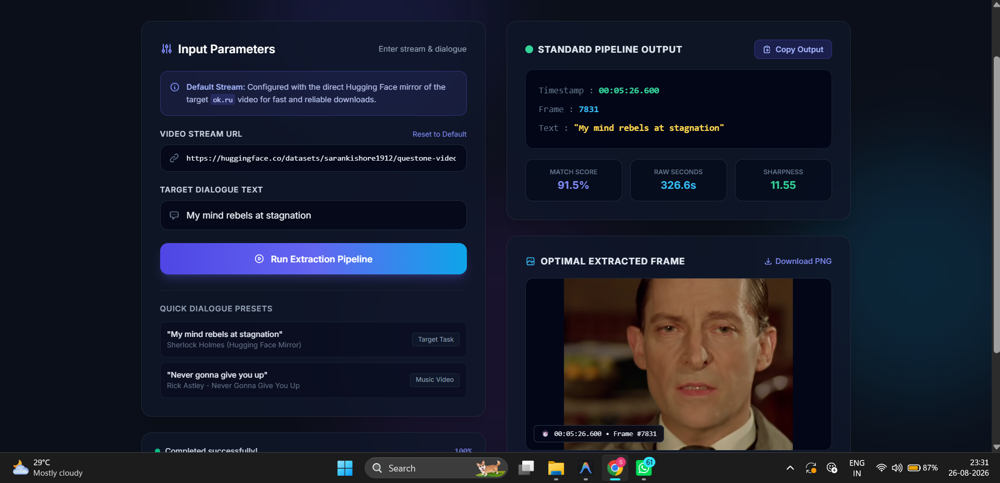

# Audio-Visual Dialogue Extractor & Timestamp Identifier

An automated pipeline that locates the **exact timestamp of a spoken phrase** inside a video and extracts the sharpest matching frame — powered by OpenAI **Whisper** for transcription and **fuzzy string matching** for phrase location.



---

## Summary

Give the pipeline a video and a line of dialogue, and it returns:
- The exact timestamp the line is spoken
- The matching frame number
- A confidence (match) score
- The sharpest extracted frame at that moment, saved as a PNG

It does this by transcribing the video with word-level timestamps, fuzzy-matching your target phrase against that transcript, then scanning a small window around the matched timestamp to pick the least blurry frame.

---

## How to Run It

1. **Install dependencies**
   ```bash
   pip install torch torchvision torchaudio --index-url https://download.pytorch.org/whl/cu124
   pip install openai-whisper rapidfuzz
   ```

2. **Start the app**
   ```bash
   python app.py
   ```

3. **Provide inputs** in the UI (or via `execute_pipeline()` directly):
   - **Video Stream URL** — the source video
   - **Target Dialogue Text** — the line you want to locate

4. **Run the pipeline** and review the output:
   - Timestamp, frame number, and matched text
   - Match score and frame sharpness score
   - Downloadable PNG of the extracted frame

---

## Why We Used a Hugging Face Space for Video Ingestion

Downloading video directly from the local machine turned out to be unreliable — source platforms increasingly block direct, non-browser requests with bot-detection and network-level checks, regardless of client spoofing, cookies, or retries.

To make ingestion reliable, video acquisition was moved off the local machine and routed through a **Hugging Face Space** acting as a mirror/fetch layer. The pipeline then downloads from that Space instead of the original platform, avoiding the local network blocks entirely and giving the pipeline a fast, consistent source to pull from every run.

---

For the full stage-by-stage pipeline breakdown and diagram, see **`PROJECT_FLOW.md`**.
For a log of engineering issues and how they were solved, see **`CHALLENGES_AND_DECISION_MAKING.md`**.
